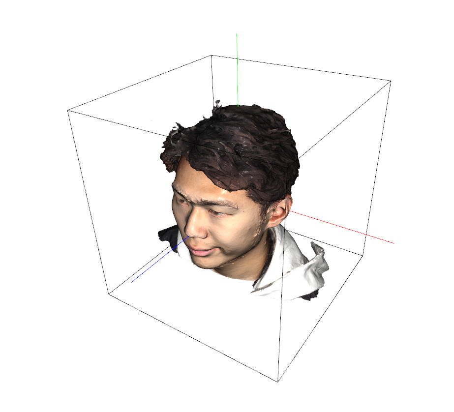

<!-- PROJECT LOGO -->
<br />
<h1 align="center">ReFLAME : WarpHE4D based FLAME fitting</h1>

<p align="center">
  <a href="https://jseobyun.github.io/"><strong>Jongseob Yun</strong></a>
</p>
<br />
<p align="center">
    
    
    
    
</p>

<br />


## Acknowledgement

- I sincerely thank [large-steps](https://github.com/rgl-epfl/large-steps-pytorch), whose work was of great help and inspiration. I strongly encourage everyone to read this outstanding paper!
- I also appreciate to [DWpose](https://github.com/IDEA-Research/DWPose). It was the final piece that refined eye and mouth regions.
- The sources of visualizations are [FaceScape](https://facescape.nju.edu.cn/), [FaceVerse](https://github.com/LizhenWangT/FaceVerse), [NPHM](https://github.com/SimonGiebenhain/NPHM) datasets. I truly appreciate to authors. 

## Notification

- This repository provides an effective pipeline for **fitting the FLAME model** to arbitrary textured 3D head meshes (OBJs).
- UVs from **WarpHE4D** are primarily used to improve performance beyond standard cues (e.g. landmarks, masks, depths).
- I didn't use FLAME linear bases during the optimization. Only landmark embeddings.npy is required. 
- I'm happy to see that even non-facial regions are well fitted! Make it as FLAME easily.
- I'm sorry for not providing an example head mesh, as most head meshes are protected under licenses and cannot be publicly shared.

## Installation

- The main structure of this repository stems from [large-steps](https://github.com/rgl-epfl/large-steps-pytorch). Please check it first.

```bash
git clone --recursive https://github.com/jseobyun/WarpHE4D_ReFLAME.git
cd reflame
pip install .
```


- To install `nvdiffrast` and the Botsch-Kobbelt remesher, which are provided as submodules, please run the `setup_dependencies.sh` script.
```bash
sh setup_dependecies.sh
```

- `nvdiffrast` relies on the `cudatoolkit-dev` package to compile modules at runtime.
To install it with Anaconda:
```bash
conda install -c conda-forge cudatoolkit-dev
```

- To install the other dependencies needed to run the experiments, also run:
```bash
pip install -r requirements.txt
```

## Prerequisites
- Download pretrained WarpHE4D checkpoint from here and place it into `./ckpts/warphead/warph3ad_fast.pt`.
- Download DWpose from [HuggingFace](https://huggingface.co/yzd-v/DWPose) and place them into `./ckpts/yzd-v/DWPose/*`.
- Download `landmark_embedding.npy` from [FLAME](https://flame.is.tue.mpg.de) and place it into `./templates/FLAME2023/landmark_embedding.npy`.

## Data preparation
- Even though UV supervision significantly reduces the need for hard initialization steps such as Procrustes alignment or ICP, it still requires a mild initialization.
<p align="center">
  
</p>

- As shown in above Figure, 3D head mesh should be within unit cube bounded in [-1, 1].
- Additionally, +y axis is up-direction and +z axis is front facing direction (Red: x axis, Green : y axis, Blue : z axis)
```
$DATA_DIR
  |-???.obj (obj file that contains vt)
  |-???.mtl (mtl file that include texture map name with map_Kd keyword)
  |-???.png/jpg/jpeg (texture map image, under 2K recomended for preventing rendering failure)

```

- Each data should be formatted like above structure.


## Usage
```bash
cd reflame
python3 run_fit.py --data_dir $DATA_DIR --opt_lambda 30 --coarse_steps 1000 --refine_steps 300 --texture_steps 1000 --azim_range 150
# add --vis and --save if you need to visualize or save the results.
# $DATA_dir should contain a single set of textured mesh (obj, mtl, png/jpg/jpeg)
```
- If the result is not good, tune the hyperparameters first. In my experience, keypoint loss is too powerful, so carefully tune it.
- opt_lambda works similar as Laplacian smoothing factor. If it increases, mesh deformation become smooth and stiff. 30 is best!
- After FLAME fitting, 1K (1024, 1024) texture map is optimized together.
<p align="center">
  
  
  
  
</p>

- Since differentiable rendering based texture optimization is very sensitive to view selections, there are some artifacts on the final texture map result.
- If you want to improve this, consider more various views (not implemented in this code) or novel loss functions (I will appreciate if you share with me.). 
  
<p align="center">
  
  
  
  
</p>

## License
- This code is provided under a 3-clause BSD license that can be found in the LICENSE file. By using, distributing, or contributing to this project, you agree
to the terms and conditions of this license.

- Additionally, the final lincense is extended version of original license of [large-steps](https://github.com/rgl-epfl/large-steps-pytorch).
- I recommend everyone to double-check both licenses.

## Citation

If you use this code for academic research, please cite our method using the following BibTeX entry:

```bibtex
# warphead will be updated after ICCV 2025

@article{Nicolet2021Large,
    author = "Nicolet, Baptiste and Jacobson, Alec and Jakob, Wenzel",
    title = "Large Steps in Inverse Rendering of Geometry",
    journal = "ACM Transactions on Graphics (Proceedings of SIGGRAPH Asia)",
    volume = "40",
    number = "6",
    year = "2021",
    month = dec,
    doi = "10.1145/3478513.3480501",
    url = "https://rgl.epfl.ch/publications/Nicolet2021Large"
}

@inproceedings{yang2023effective,
  title={Effective whole-body pose estimation with two-stages distillation},
  author={Yang, Zhendong and Zeng, Ailing and Yuan, Chun and Li, Yu},
  booktitle={Proceedings of the IEEE/CVF International Conference on Computer Vision},
  pages={4210--4220},
  year={2023}
}
```
