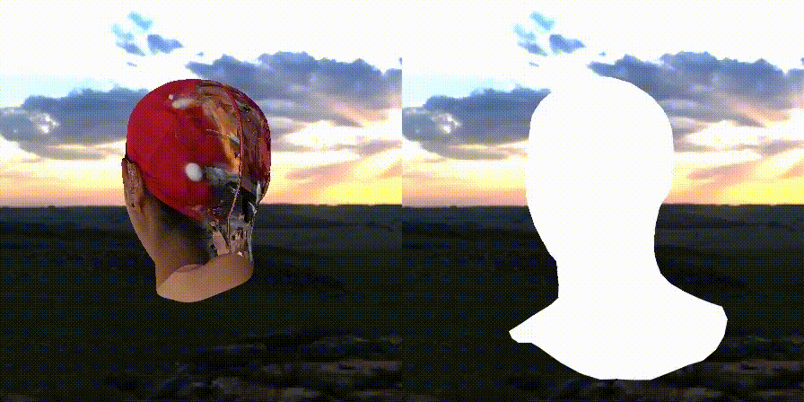
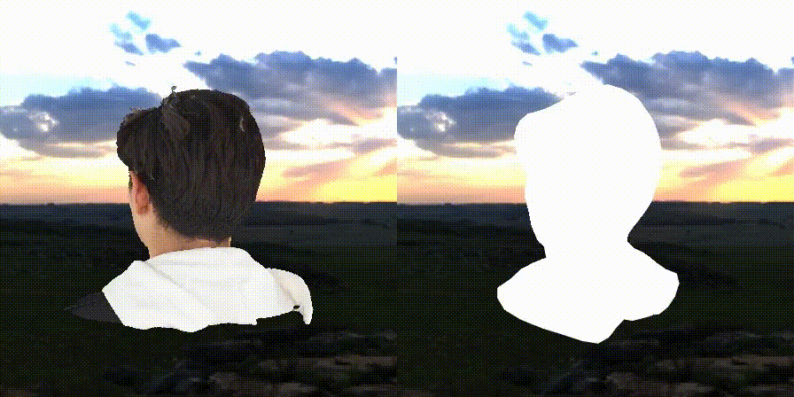
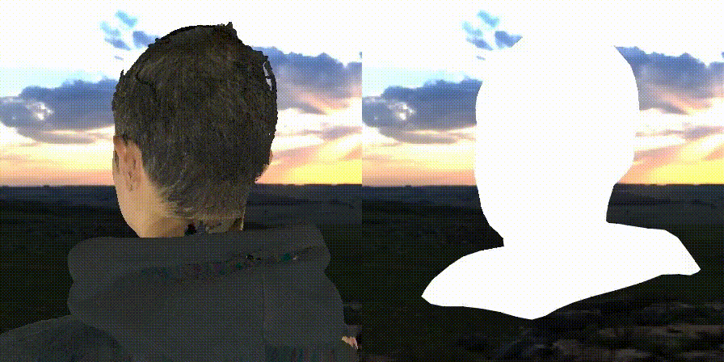
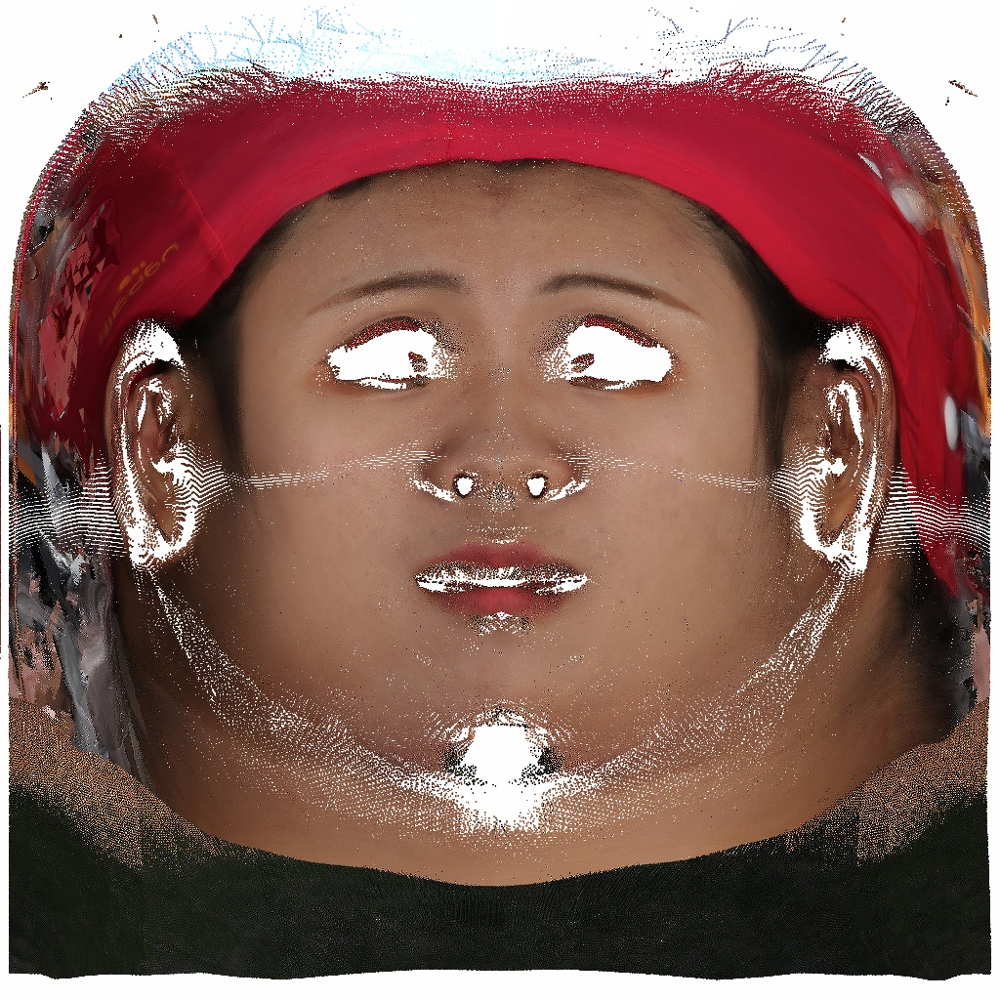
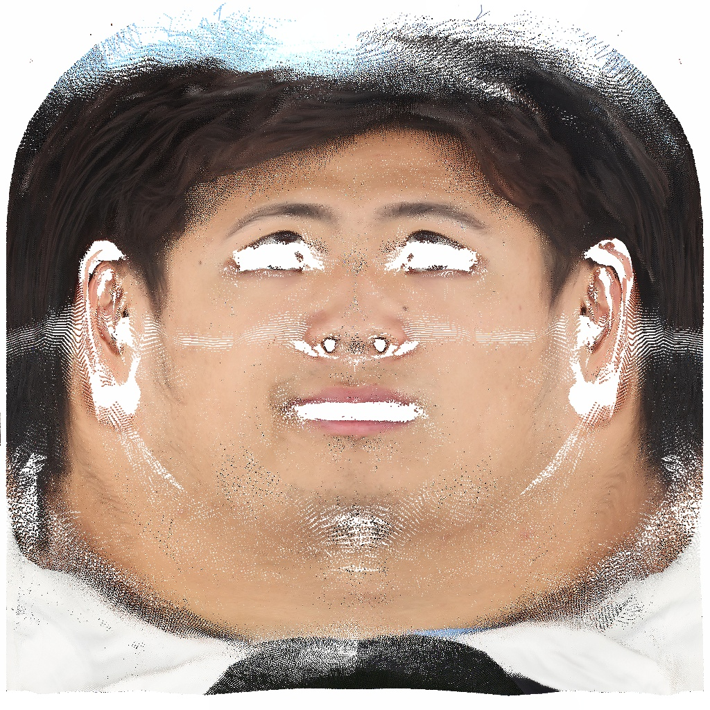
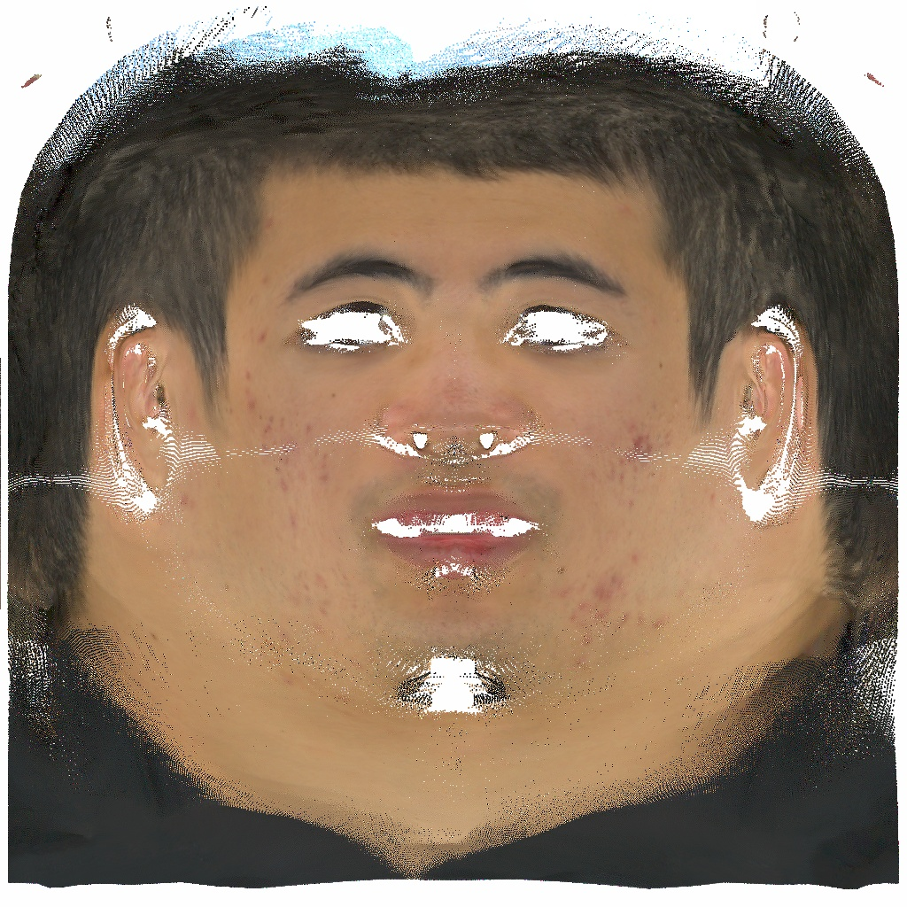
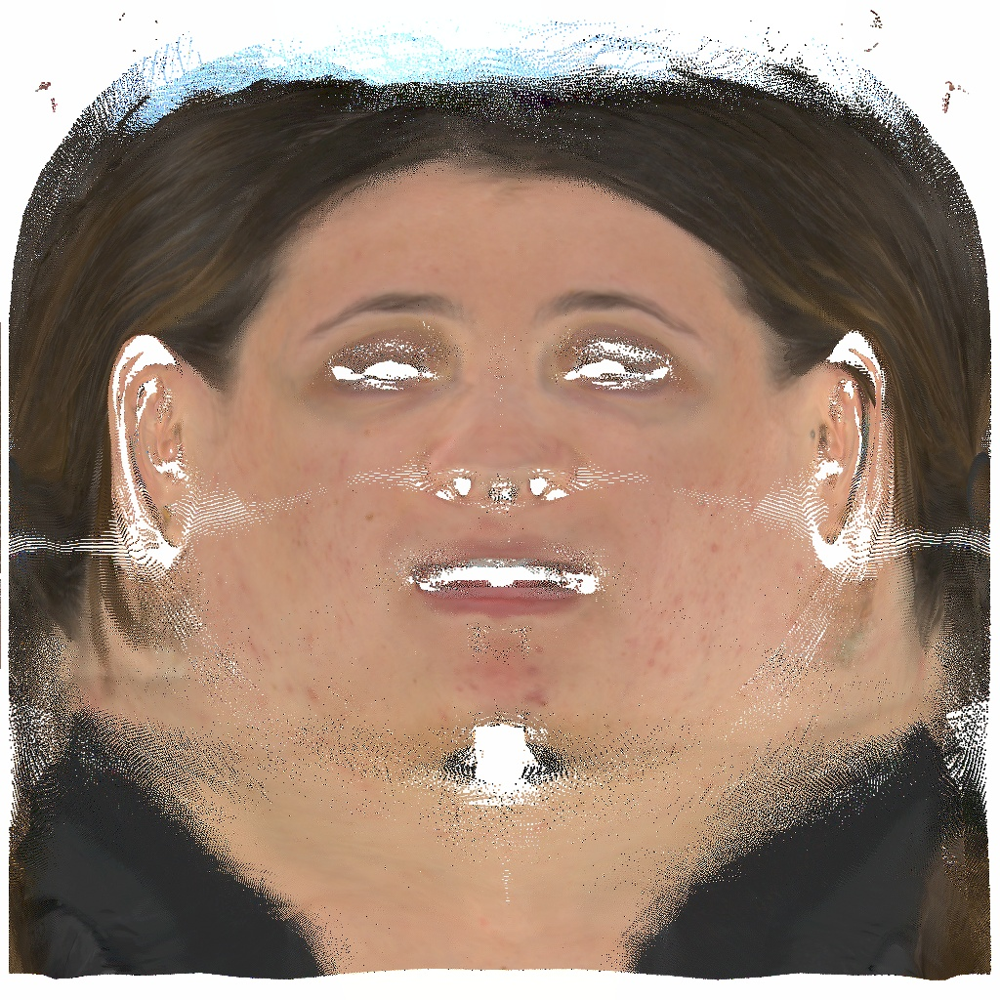

<!-- PROJECT LOGO -->
<br />
<p align="center">
  <h1 align="center">ReFLAME : WarpHE4D based FLAME fitting on 3D Head</h1>
  <p align="center">    
    <a href="https://jseobyun.github.io/"><strong>Jongseob Yun</strong></a>
  </p>  
  
  
  
  
</p>

<br />
<br />


<!-- TABLE OF CONTENTS -->
<details open="open" style='padding: 10px; border-radius:5px 30px 30px 5px; border-style: solid; border-width: 1px;'>
  <summary>Table of Contents</summary>
  <ol>
    <li>
      <a href="#Acknowledgement">Acknowledgement</a>      
    </li>
    <li>
      <a href="#notification">Notification</a>      
    </li>
    <li>
      <a href="#installation">Installation</a>      
    </li>
    <li>
      <a href="#usage">Usage</a>
    </li>
    <li>
      <a href="#license">License</a>
    </li>
    <li>
      <a href="#citation">Citation</a>
    </li>    
  </ol>
</details>
<br />
<br />

## Acknowledgement

- I sincerely thank [large-steps](https://github.com/rgl-epfl/large-steps-pytorch), whose work was of great help and inspiration. I strongly encourage everyone to read this outstanding paper!
- I also appreciate to [DWpose](https://github.com/IDEA-Research/DWPose). It was the final piece that refined eye and mouth regions."

## Notification

- This repository provides an effective pipeline for **fitting the FLAME model** to arbitrary textured 3D head meshes (OBJs).
- UVs from **WarpHE4D** are primarily used to improve performance beyond standard cues (e.g. landmarks, masks, depths).
- As a result, I'm happy to see that even non-facial regions are well fitted!

## Installation

- The main structure of this repository stems from [large-steps](https://github.com/rgl-epfl/large-steps-pytorch). Please check it first.

```bash
git clone --recursive https://github.com/jseobyun/ReFLAME.git
cd reflame
pip install .
```


- To install `nvdiffrast` and the Botsch-Kobbelt remesher, which are provided as submodules, please run the `setup_dependencies.sh` script.
```bash
sh setup_dependecies.sh
```

- `nvdiffrast` relies on the `cudatoolkit-dev` package to compile modules at runtime.
To install it with Anaconda:
```bash
conda install -c conda-forge cudatoolkit-dev
```

- To install the other dependencies needed to run the experiments, also run:
```bash
pip install -r requirements.txt
```

## Usage
```bash
cd reflame
python3 run_fit.py --data_dir $DATA_DIR --opt_lambda 30 --coarse_steps 1000 --refine_steps 300 --texture_steps 1000 --azim_range 150
# add --vis and --save if you need to visualize or save the results.
# $DATA_dir should contain a single set of textured mesh (obj, mtl, png/jpg/jpeg)
```
- After FLAME fitting, 1K (1024, 1024) texture map is optimized together.
<p align="center">
  
  
  
  
</p>

- Since differentiable rendering based texture optimization is very sensitive to view selection, there is some artifact on the final texture map result.
- If you want to improve this, consider more various views (not implemented in this code) or novel loss functions (I will appreciate if you share with me.). 
  
<p align="center">
  
  
  
  
</p>

## License
- This code is provided under a 3-clause BSD license that can be found in the LICENSE file. By using, distributing, or contributing to this project, you agree
to the terms and conditions of this license.

- Additionally, the final lincense is extended version of original license of [large-steps](https://github.com/rgl-epfl/large-steps-pytorch).
- I recommend everyone to double-check both licenses.

## Citation

If you use this code for academic research, please cite our method using the following BibTeX entry:

```bibtex
# warphead will be updated after ICCV 2025

@article{Nicolet2021Large,
    author = "Nicolet, Baptiste and Jacobson, Alec and Jakob, Wenzel",
    title = "Large Steps in Inverse Rendering of Geometry",
    journal = "ACM Transactions on Graphics (Proceedings of SIGGRAPH Asia)",
    volume = "40",
    number = "6",
    year = "2021",
    month = dec,
    doi = "10.1145/3478513.3480501",
    url = "https://rgl.epfl.ch/publications/Nicolet2021Large"
}

@inproceedings{yang2023effective,
  title={Effective whole-body pose estimation with two-stages distillation},
  author={Yang, Zhendong and Zeng, Ailing and Yuan, Chun and Li, Yu},
  booktitle={Proceedings of the IEEE/CVF International Conference on Computer Vision},
  pages={4210--4220},
  year={2023}
}
```
